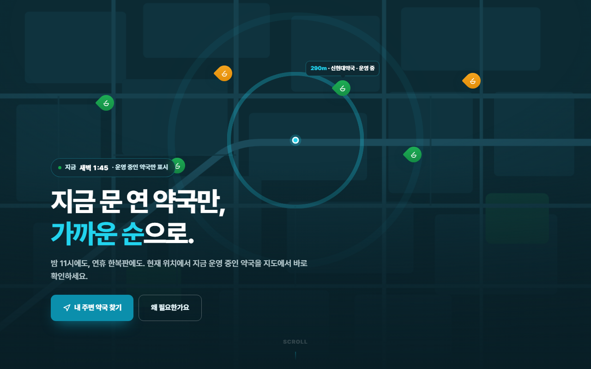
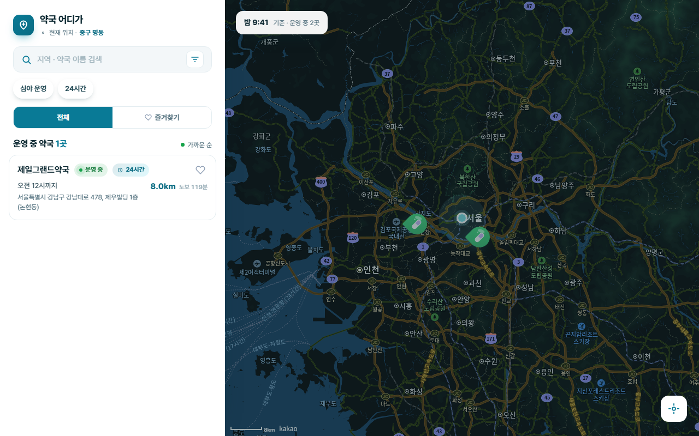
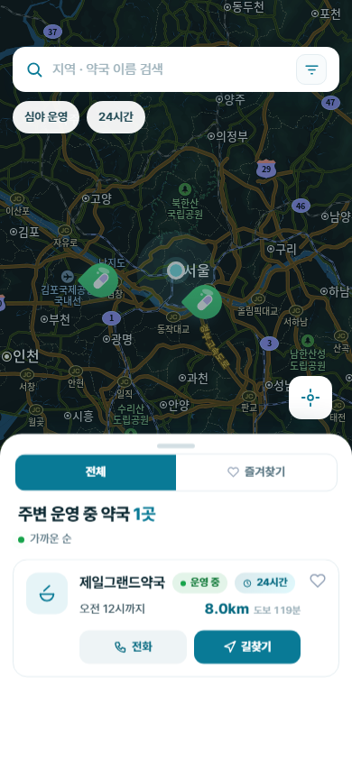

# 약국 어디가

> 지금 문 연 약국만, 가까운 순으로.

위치 기반으로 **지금 운영 중인 약국**을 지도와 거리순 목록으로 보여주는 웹 서비스. **[바로가기](https://find-pharmacy-puce.vercel.app/)**



## 기능

- 위치 기반 주변 약국 검색 — 운영중 / 곧마감 / 영업종료 실시간 상태 계산
- 지도 핀 ↔ 목록 카드 상호 연동, 카드 클릭 시 지도 이동
- 지도 이동 후 "이 위치에서 재검색"
- 전국 지역·약국 이름 실시간 검색
- 심야·24시간 운영 필터, 즐겨찾기
- 위치 권한 거부 시 지역 직접 검색으로 대체

<p>
  
  
</p>

## 기술적으로 신경 쓴 부분

| 항목          | 내용                                                                                                                                              |
| ------------- | ------------------------------------------------------------------------------------------------------------------------------------------------- |
| **성능**      | React Profiler로 리스트 카드 hover 시 목록 전체가 리렌더되는 병목을 확인 → `React.memo` + `useCallback`/`useMemo`로 해당 카드만 리렌더되도록 개선 |
| **서버 상태** | TanStack Query 도입 — 손수 만든 캐시(`useRef` Map)를 대체, 검색 좌표별 캐싱·중복 요청 제거                                                        |
| **접근성**    | 카드/검색결과 키보드 조작(`role`/`tabIndex`/`keydown`), 전역 `:focus-visible`, WCAG AA 색 대비 조정 — Lighthouse 접근성 100점                     |
| **테스트**    | Playwright E2E 4개 플로우(진입·상세·키보드·검색) — GPS·외부 공공 API·지도 SDK를 목킹해 결정론적으로 실행                                          |
| **거리 표시** | 재검색 시 필터링 기준(검색 위치)과 화면 표시 기준(내 실제 위치)을 분리해, 먼 동네를 재검색해도 결과가 누락되지 않으면서 거리 정보는 정직하게 표시 |

## 기술 스택

- **프레임워크**: Next.js 15 (App Router) · TypeScript · Tailwind CSS v4
- **서버 상태**: TanStack Query v5
- **지도**: 카카오맵 JavaScript SDK (역지오코딩 + 키워드 검색)
- **데이터**: 공공데이터포털 · 국립중앙의료원 응급의료정보 서비스 (약국 위치·운영시간)
- **테스트**: Playwright
- **배포**: Vercel

## 폴더 구조

```
app/
  page.tsx        # 랜딩 페이지 (루트 "/")
  map/page.tsx    # 지도 앱 화면 ("/map")
  api/            # 공공 API 프록시 — 키 은닉 + XML → JSON 변환
components/       # UI 컴포넌트
lib/              # API 클라이언트, 도메인 로직(운영중 판정 등), 지오코딩
e2e/              # Playwright E2E 스펙
```

## 알려진 한계

- 공공데이터 특성상 임시 휴무·급작스러운 영업시간 변경이 즉시 반영되지 않을 수 있습니다.
- 의료 상담을 대체하지 않으며, 특정 약국을 추천·보증하지 않습니다.
